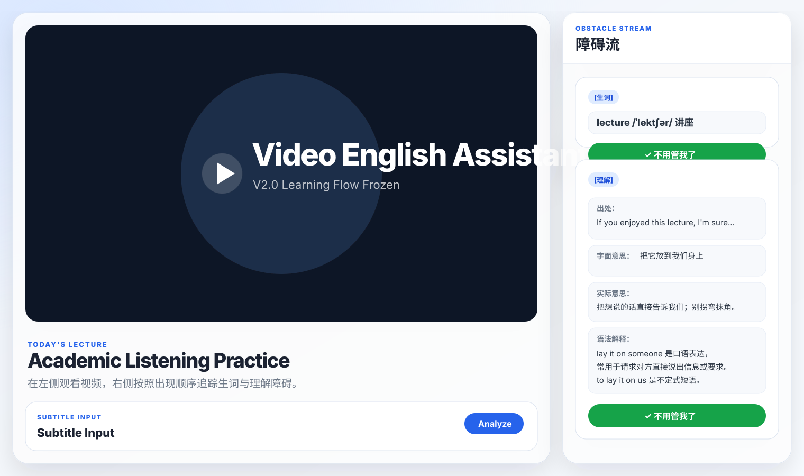

# video-english-assistant

一个纯 HTML/CSS/Vanilla JavaScript 实现的 Video English Assistant。

当前版本：V2.0 Learning Flow Frozen。

V2.0 冻结学习流程逻辑：产品不追求让用户永久掌握所有单词、语法或考试能力，而是帮助用户扫除视频学习英语过程中的障碍，让用户越来越顺畅地听懂、看懂英语视频，并通过持续跨越障碍建立信心、提高效率、保持动力。

```text
Subtitle Text
↓
Analyze
↓
Obstacle Detection Engine
↓
Obstacle Stream
↓
✓ 不用管我了
↓
Resolved and hidden from future Analyze results
```

## 项目结构

```text
video-english-assistant/
├── index.html
├── styles.css
├── script.js
├── preview-v1.5.svg
├── preview-v1.7.svg
├── preview-v1.9.svg
├── preview-v2.0.svg
└── README.md
```

## 功能

- 左侧 70% 视频学习区，右侧 30% 障碍流。
- 障碍流按出现顺序只显示「生词」和「理解」两种障碍卡片。
- 生词卡片固定字段：生词、音标、中文释义。
- 理解卡片固定字段：出处、字面意思、实际意思、语法解释。
- 理解卡展示方式为「字段：内容」同一行展示，提高阅读密度。
- 点击「✓ 不用管我了」表示该内容从现在开始不再是用户理解当前视频的障碍。
- 点击「✓ 不用管我了」后，系统会将该障碍记录为 `resolved`，从障碍流隐藏，并保存到 `localStorage`。
- 已 `resolved` 的障碍会跨 Analyze 生效；以后再次 Analyze 出同一个内容时，不再进入障碍流。
- 右侧障碍流支持滚动。
- 支持平板和手机响应式布局。
- V2.0 删除「恢复全部」「恢复障碍」及相关 UI、逻辑和说明。

## V2.0 Learning Flow Frozen

### 一、产品目标

本产品的目标不是：

- 让用户背完所有单词
- 让用户掌握所有语法
- 让用户通过考试

本产品的目标是：

帮助用户扫除视频学习英语过程中的障碍，让用户能够越来越顺畅地听懂、看懂英语视频。

通过不断跨越障碍，用户可以：

- 建立信心
- 提高学习效率
- 保持持续学习的动力

最终实现：

- 能够盲听听懂英语内容
- 能够跟读、跟说英语内容
- 能够逐渐开口表达英语

### 二、产品衡量标准

产品不以「是否永久掌握单词」作为衡量标准。

产品以「这个内容是否还在妨碍用户理解当前视频」作为衡量标准。

如果某个内容已经不再构成障碍，用户就可以点击：

```text
✓ 不用管我了
```

### 三、障碍定义

障碍只有两种：

1. 生词障碍
2. 理解障碍

V2.0 保持 V1.6 Frozen 障碍规则不变：障碍流只处理会妨碍用户理解当前视频的「生词」和「理解」问题。

### 四、✓ 不用管我了

「✓ 不用管我了」的含义是：

从现在开始，这个内容不再是用户的障碍。

它不是：

- 永久掌握
- 英语毕业
- 永远不会忘记

它只是表示：

这个内容已经不会妨碍用户理解剧情。

### 五、点击 ✓ 不用管我了

用户点击「✓ 不用管我了」后，系统执行：

1. 记录为 `resolved`
2. 从障碍流隐藏
3. 保存到 `localStorage`

### 六、跨 Analyze 规则

如果 `lecture` 已经点击「✓ 不用管我了」，那么以后再次 Analyze 时，`lecture` 不再进入障碍流。

示例：

```text
第一次 Analyze：
lecture
↓
✓ 不用管我了

第二次 Analyze：
lecture
↓
不显示

第三次 Analyze：
lecture
↓
不显示
```

### 七、关于遗忘

V2.0 暂不解决：

- 遗忘曲线
- 长期记忆
- 永久掌握

原因：产品优先解决 80% 的核心问题。

V2.0 暂不增加：

- 已解决障碍库
- 手动恢复
- 重新激活

如果用户未来忘记某个内容，属于正常学习现象，未来版本再讨论。

### 八、删除功能

V2.0 删除：

- 恢复全部
- 恢复障碍
- 相关 UI
- 相关逻辑
- 相关 README 内容

原因：恢复障碍与真实学习流程冲突。

真实学习流程是：

```text
看视频
↓
发现障碍
↓
解决障碍
↓
继续看视频
```

而不是：

```text
恢复障碍
恢复障碍
恢复障碍
```

### 九、未来规划（仅记录）

未来可能增加：

- 本集学习完成
- 重新学习本集
- 下一集

但 V2.0 不实现这些功能。等待视频播放流程成熟后再设计。

## V1.7 障碍识别规则

### 生词障碍

根据用户词汇等级判断单词是否超出范围。当前支持等级：

- 初中：`junior`
- 高中：`senior`
- CET4：`cet4`
- CET6：`cet6`
- 自定义词汇量：`custom`

超出当前等级的单词会进入「生词障碍」。例如在初中等级下：

```text
If you enjoyed this lecture, I'm sure you're too busy to lay it on us.
```

会识别出：

```text
生词障碍：lecture
```

### 理解障碍

理解障碍与词汇等级无关，用于识别：

- 固定搭配
- 短语动词
- 习语
- 俚语
- 非字面义表达

当前内置识别项：

- `lay it on us`
- `pull me off the project`
- `straight up`
- `come on`

例如：

```text
理解障碍：lay it on us
```

## Analyze Workflow

点击左侧视频区域下方的 `Analyze` 按钮后，页面会读取 `Subtitle Input` 多行文本框中的英文字幕文本，调用 `ObstacleDetectionEngine.analyzeSubtitleText()` 生成新的障碍流，并重新渲染右侧卡片。

生词障碍优先输出，理解障碍第二优先输出。生词卡片固定显示：生词、音标、中文释义；理解卡片固定显示：出处、字面意思、实际意思、语法解释。

Analyze 不会清空已 `resolved` 的障碍。已点击「✓ 不用管我了」的内容会继续从新生成的障碍流中隐藏。

## 使用方式

直接用浏览器打开 `index.html`，或使用任意静态文件服务器运行本项目。

页面默认在 `Subtitle Input` 中填入示例字幕：

```text
If you enjoyed this lecture, I'm sure you're too busy to lay it on us.
```

点击 `Analyze` 后会生成：

```text
生词障碍：lecture
理解障碍：lay it on us
```

如果点击 `lecture` 卡片上的「✓ 不用管我了」，再点击 `Analyze`，`lecture` 不会再次显示；如果 `lay it on us` 尚未 resolved，则理解障碍仍会显示。

也可以在浏览器控制台调用引擎：

```js
ObstacleDetectionEngine.analyze(
  "If you enjoyed this lecture, I'm sure you're too busy to lay it on us.",
  { level: 'junior' },
);
```

返回并渲染：

```text
生词障碍：lecture
理解障碍：lay it on us
```

如需加入用户自定义已掌握词汇：

```js
ObstacleDetectionEngine.analyze(
  'Please pull me off the project.',
  {
    level: 'custom',
    customWords: ['please', 'pull', 'me', 'off', 'the', 'project'],
  },
);
```

## Testing

```text
✅ node --check script.js
✅ V2.0 resolved localStorage workflow test
✅ restore UI removal check
✅ webpage preview screenshot generated
```

## V2.0 暂不包含

- 暂不接视频。
- 暂不接字幕文件。
- 暂不接播放器。
- 暂不解决遗忘曲线。
- 暂不建设长期记忆系统。
- 暂不追求永久掌握。
- 暂不增加已解决障碍库。
- 暂不增加手动恢复。
- 暂不增加重新激活。
- 暂不实现「本集学习完成」。
- 暂不实现「重新学习本集」。
- 暂不实现「下一集」。

## 网页预览截图

V2.0 保持 V1.5 左侧 70% / 右侧 30% 页面布局与整体视觉风格，冻结学习流程逻辑，移除恢复入口，并让「✓ 不用管我了」成为 resolved 后跨 Analyze 隐藏的唯一完成动作。


