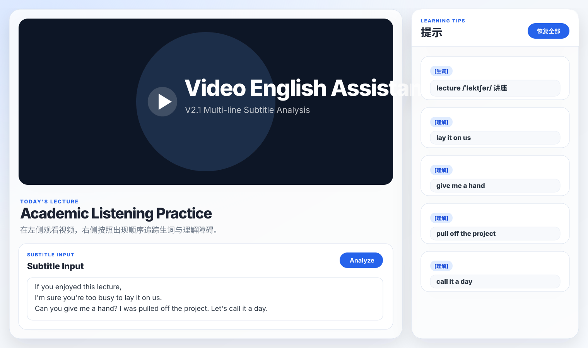

# video-english-assistant

一个纯 HTML/CSS/Vanilla JavaScript 实现的 Video English Assistant。

当前版本：V2.4A Obstacle Timeline Static Prototype – 在 V2.3A 冻结交互基础上新增视频时间轴与障碍热力轴。

V2.0 冻结学习流程逻辑：产品不追求让用户永久掌握所有单词、语法或考试能力，而是帮助用户扫除视频学习英语过程中的障碍，让用户越来越顺畅地听懂、看懂英语视频，并通过持续跨越障碍建立信心、提高效率、保持动力。

```text
Subtitle Text
↓
Analyze
↓
Obstacle Detection Engine
↓
Current Subtitle Learning Tips
↓
✓ 不用管我了
↓
Hide this one card only; playback state is unchanged
```

## 项目结构

```text
video-english-assistant/
├── index.html
├── styles.css
├── script.js
├── test-current-subtitle-sync.js
├── preview-v1.5.svg
├── preview-v1.7.svg
├── preview-v1.9.svg
├── preview-v2.0.svg
├── preview-v2.0b.svg
├── preview-v2.1.svg
├── screenshot-v2.3a-lecture-lay-it-on-us.svg
├── screenshot-v2.3a-give-me-a-hand.svg
├── screenshot-v2.3a-pull-off-the-project.svg
└── README.md
```

## 功能

- 左侧 70% 视频学习区，右侧 30% 提示面板。
- Learning Tips 只显示当前播放字幕中的「生词」和「理解」障碍，不显示上一句、下一句或整段视频的全局障碍。
- 生词卡片固定字段：生词、音标、中文释义。
- 理解卡片固定字段：出处、字面意思、实际意思、语法解释。
- 理解卡展示方式为「字段：内容」同一行展示，提高阅读密度。
- 点击「✓ 不用管我了」只隐藏当前这一个 Learning Tips 卡片，不控制播放、不自动跳转、不恢复视频。
- 点击「恢复全部」只恢复当前轮次隐藏过的提示卡片，不控制播放，且 Learning Tips 仍然只显示当前字幕段中的障碍。
- 支持在 `Subtitle Input` 中输入 10~50 句多行字幕，并按照字幕出现顺序生成提示流。
- 同一障碍在同一次 Analyze 中只出现一次；理解短语内部的单词不再额外拆成生词提示。
- 点击右侧栏顶部「恢复全部」后，当前轮次已隐藏的生词提示和理解提示会重新显示，但仍然只限于当前播放字幕，且不改变当前播放 / 暂停状态。
- 右侧提示流支持滚动。
- 支持平板和手机响应式布局。

## V2.3A Hot Fix – Current Subtitle Learning Tips

V2.3A 修复 Learning Tips 回归为“全视频障碍列表”的问题，恢复与当前播放字幕同步的 Dynamic Obstacle Stream 行为。

冻结规则：

- Learning Tips 只显示当前播放字幕中的障碍；不预加载上一句、下一句或整段视频的障碍。
- 如果当前字幕包含多个障碍，必须全部显示。
- 显示顺序固定为：先显示 Vocabulary Obstacles（生词），再显示 Comprehension Obstacles（理解）。同类型内部按该障碍在当前字幕中的出现顺序排序。
- 当前字幕变化时，Learning Tips 自动更新，旧字幕障碍消失，新字幕障碍出现。
- Learning Tips 不是全局障碍导航器；V2.4 Timeline 和 V2.5 Obstacle Navigator 会另行实现全局导航能力。

### V2.3A 验证流程

使用默认测试字幕：

```text
If you enjoyed this lecture,
I'm sure you're too busy to lay it on us.

Can you give me a hand?

I was pulled off the project.

Let's call it a day.
```

期望：

1. 当前字幕为 `If you enjoyed this lecture, I'm sure you're too busy to lay it on us.` 时，Learning Tips 只显示 `lecture` 和 `lay it on us`。
2. 当前字幕为 `Can you give me a hand?` 时，Learning Tips 只显示 `give me a hand`。
3. 当前字幕为 `I was pulled off the project.` 时，Learning Tips 只显示 `pull off the project`，不显示 `lay it on us`、`give me a hand` 或 `call it a day`。
4. 播放完整 demo sequence 时，Learning Tips 随字幕推进自动变化，任何时刻都不显示全视频障碍列表。

### V2.3A 截图

- `screenshot-v2.3a-lecture-lay-it-on-us.svg`：当前字幕为 `lecture + lay it on us`。
- `screenshot-v2.3a-give-me-a-hand.svg`：当前字幕为 `give me a hand`。
- `screenshot-v2.3a-pull-off-the-project.svg`：当前字幕为 `pull off the project`。

## V2.3A Final Interaction Rules

V2.3A Final Interaction Hot Fix 将 Learning Tips 的卡片管理职责与视频播放控制职责彻底解耦，避免同一字幕中存在多个障碍时，用户只隐藏其中一个卡片却意外恢复播放。

冻结规则：

1. 点击视频区域：视频播放 / 暂停双向切换；Desktop mouse click 与 Mobile touch 都支持；点击视频任意非障碍区域都可以控制播放与暂停。
2. 点击播放按钮：播放 / 暂停双向切换；行为与点击视频区域一致。
3. 点击字幕障碍虚线：进入 Learning Pause，视频强制暂停，Learning Pause Hint 显示，Learning Tips 显示当前字幕全部障碍；点击虚线只作为学习暂停入口，不把 Learning Tips 过滤成单个障碍。
4. Learning Tips：始终只显示当前字幕段中的障碍；如果当前字幕中有多个障碍则全部显示；显示顺序为生词障碍优先、理解障碍其次，同类内部按字幕出现顺序排序；不要显示整个视频的全部障碍。
5. ✓ 不用管我了：只负责隐藏当前这一个障碍卡片；不要控制视频播放，不要恢复播放，不要暂停视频，不要跳到下一条；如果当前字幕还有其他障碍卡片，它们继续显示；如果当前字幕所有障碍都被隐藏，Learning Tips 可以显示空状态，但视频播放状态不变。
6. 恢复全部：只负责恢复当前轮次隐藏过的障碍；不要控制视频播放，不要改变当前播放 / 暂停状态；恢复后仍然只显示当前字幕段中的障碍，不变成全视频障碍列表。
7. Learning Pause Hint：点击虚线进入 Learning Pause 后显示；自动淡出时间保持约 5.5 秒；点击“知道了”后在本设备永久隐藏。
8. 播放逻辑统一归视频播放器：只有点击视频区域、点击播放按钮、点击字幕虚线时强制进入 Learning Pause 可以控制播放；✓ 不用管我了、恢复全部、Learning Tips 卡片渲染、Learning Tips 自动同步、当前字幕障碍切换都不得控制播放状态。

### V2.3A Final Acceptance Tests

使用默认第一段字幕：

```text
If you enjoyed this lecture,
I'm sure you're too busy to lay it on us.
```

期望：

1. Learning Tips 同时显示 `lecture` 和 `lay it on us`。
2. 点击 `lay it on us` 虚线后，视频暂停，Learning Pause Hint 显示，Learning Tips 仍然显示 `lecture` 与 `lay it on us`，不要只显示 `lay it on us`。
3. Learning Pause 状态下点击 `lecture` 的「✓ 不用管我了」后，只隐藏 `lecture`，`lay it on us` 仍然显示，视频仍保持暂停，不自动播放。
4. 继续点击 `lay it on us` 的「✓ 不用管我了」后，当前字幕障碍为空，视频仍保持暂停，不自动播放。
5. 点击视频区域后视频恢复播放。
6. 播放状态下点击视频区域后视频暂停。
7. 暂停状态下点击视频区域后视频播放。
8. 点击「恢复全部」后，隐藏障碍恢复，Learning Tips 仍只显示当前字幕障碍，不显示全视频障碍，不改变当前播放 / 暂停状态。

## V2.2 Dynamic Obstacle Stream Frozen

V2.2 将提示从“一次性全部显示”升级为“按照字幕出现顺序动态出现”。Analyze 仍然会先分析整段字幕并生成完整队列，但右侧提示区默认只展示当前需要处理的一条提示。

动态队列规则：

- Analyze 后生成生词提示与理解提示队列。
- 队列按字幕中出现顺序排列，不按类型分组。
- 默认只显示队列中的第一条未隐藏提示。
- 点击「✓ 不用管我了」表示当前轮次该提示已经不再构成理解障碍，系统会隐藏当前提示并自动显示下一条提示。
- 当最后一条提示处理完成后，右侧显示「当前视频内容没有需要处理的障碍。」
- 「恢复全部」只恢复当前轮次已隐藏提示，不写入知识库，也不代表永久掌握。

### V2.2 验证流程

使用默认测试字幕：

```text
If you enjoyed this lecture,
I'm sure you're too busy to lay it on us.

Can you give me a hand?

I was pulled off the project.

Let's call it a day.
```

期望动态出现顺序：

```text
lecture
↓
lay it on us
↓
give me a hand
↓
pull off the project
↓
call it a day
↓
当前视频内容没有需要处理的障碍。
```

## V2.1 Multi-line Subtitle Analysis

V2.1 开始支持 10~50 句多行字幕输入。Analyze 会在同一段字幕文本中同时识别：

1. 生词障碍
2. 理解障碍

输出规则：

- 仅保留「生词」和「理解」两种提示类型。
- 按字幕中的出现顺序输出，不按类型分组。
- 同一障碍在同一次 Analyze 中只出现一次。
- 已点击「✓ 不用管我了」的提示，在后续 Analyze 中继续保持隐藏。
- 「恢复全部」只恢复当前轮次已隐藏提示。
- V2.0B Learning Flow Frozen 的已冻结学习流程逻辑保持不变。

### V2.1 验证字幕

```text
If you enjoyed this lecture,
I'm sure you're too busy to lay it on us.

Can you give me a hand?

I was pulled off the project.

Let's call it a day.
```

期望输出：

```text
[生词]
lecture

[理解]
lay it on us

[理解]
give me a hand

[理解]
pull off the project

[理解]
call it a day
```

## V2.0B Restore All Button

V2.0B 恢复右侧栏顶部「恢复全部」按钮，位置在「提示 / Learning Tips」标题右侧。

「恢复全部」的作用是：

恢复当前轮次已隐藏提示。

它不是：

- 永久学习状态管理
- 知识库功能
- 长期记忆系统

用户点击「✓ 不用管我了」只表示该内容在本轮学习中已经不再构成障碍；如果用户希望重新查看本轮已隐藏的生词提示或理解提示，可以点击「恢复全部」。

### V2.0B 验证流程

默认文本：

```text
If you enjoyed this lecture,
I'm sure you're too busy to lay it on us.

Can you give me a hand?

I was pulled off the project.

Let's call it a day.
```

验证：

1. 点击 `Analyze`，显示 `lecture` 和 `lay it on us`。
2. 点击 `lecture` 卡片中的「✓ 不用管我了」，`lecture` 消失。
3. 再次点击 `Analyze`，`lecture` 仍然不出现。
4. 点击「恢复全部」，`lecture` 恢复显示，`lay it on us` 仍然显示。

## V2.0A UI Copy Adjustment

右侧栏中文名称从「障碍流」调整为「提示」，英文小标题从 `OBSTACLE STREAM` 调整为 `LEARNING TIPS`，降低用户理解成本和学习压力。

## V2.0 Learning Flow Frozen

### 一、产品目标

本产品的目标不是：

- 让用户背完所有单词
- 让用户掌握所有语法
- 让用户通过考试

本产品的目标是：

帮助用户扫除视频学习英语过程中的障碍，让用户能够越来越顺畅地听懂、看懂英语视频。

通过不断跨越障碍，用户可以：

- 建立信心
- 提高学习效率
- 保持持续学习的动力

最终实现：

- 能够盲听听懂英语内容
- 能够跟读、跟说英语内容
- 能够逐渐开口表达英语

### 二、产品衡量标准

产品不以「是否永久掌握单词」作为衡量标准。

产品以「这个内容是否还在妨碍用户理解当前视频」作为衡量标准。

如果某个内容已经不再构成障碍，用户就可以点击：

```text
✓ 不用管我了
```

### 三、障碍定义

障碍只有两种：

1. 生词障碍
2. 理解障碍

V2.0 保持 V1.6 Frozen 障碍规则不变：障碍流只处理会妨碍用户理解当前视频的「生词」和「理解」问题。

### 四、✓ 不用管我了

「✓ 不用管我了」的含义是：

从现在开始，这个内容不再是用户的障碍。

它不是：

- 永久掌握
- 英语毕业
- 永远不会忘记

它只是表示：

这个内容已经不会妨碍用户理解剧情。

### 五、点击 ✓ 不用管我了

用户点击「✓ 不用管我了」后，系统执行：

1. 记录为 `resolved`
2. 从障碍流隐藏
3. 保存到 `localStorage`

### 六、跨 Analyze 规则

如果 `lecture` 已经点击「✓ 不用管我了」，那么以后再次 Analyze 时，`lecture` 不再进入障碍流。

示例：

```text
第一次 Analyze：
lecture
↓
✓ 不用管我了

第二次 Analyze：
lecture
↓
不显示

第三次 Analyze：
lecture
↓
不显示
```

### 七、关于遗忘

V2.0B 暂不解决：

- 遗忘曲线
- 长期记忆
- 永久掌握
- 已解决障碍库
- 知识库功能

原因：产品优先解决 80% 的核心问题。

V2.0B 重新提供「恢复全部」，但它只恢复当前轮次已隐藏提示，不表示永久学习状态管理，也不承担知识库功能。

如果用户未来忘记某个内容，属于正常学习现象，未来版本再讨论。

### 八、学习流程

V2.0B 保持真实学习流程：

```text
看视频
↓
发现障碍
↓
解决障碍
↓
继续看视频
```

「恢复全部」只是本轮提示重新显示入口，用于回看本轮已经隐藏的提示。

### 九、未来规划（仅记录）

未来可能增加：

- 本集学习完成
- 重新学习本集
- 下一集

但 V2.0 不实现这些功能。等待视频播放流程成熟后再设计。

## V1.7 障碍识别规则

### 生词障碍

根据用户词汇等级判断单词是否超出范围。当前支持等级：

- 初中：`junior`
- 高中：`senior`
- CET4：`cet4`
- CET6：`cet6`
- 自定义词汇量：`custom`

超出当前等级的单词会进入「生词障碍」。例如在初中等级下：

```text
If you enjoyed this lecture, I'm sure you're too busy to lay it on us.
```

会识别出：

```text
生词障碍：lecture
```

### 理解障碍

理解障碍与词汇等级无关，用于识别：

- 固定搭配
- 短语动词
- 习语
- 俚语
- 非字面义表达

当前内置识别项：

- `lay it on us`
- `give me a hand`
- `pull off the project`
- `call it a day`
- `straight up`
- `come on`

例如：

```text
理解障碍：lay it on us
```

## Analyze Workflow

点击左侧视频区域下方的 `Analyze` 按钮后，页面会读取 `Subtitle Input` 多行文本框中的英文字幕文本，调用 `ObstacleDetectionEngine.analyzeSubtitleText()` 生成新的障碍流，并重新渲染右侧卡片。

障碍会按照字幕中的出现顺序输出，不按「生词 / 理解」类型分组。生词卡片固定显示：生词、音标、中文释义；理解卡片固定显示：短语、出处、字面意思、实际意思、语法解释。

Analyze 不会清空已 `resolved` 的障碍。已点击「✓ 不用管我了」的内容会继续从新生成的障碍流中隐藏。

## 使用方式

直接用浏览器打开 `index.html`，或使用任意静态文件服务器运行本项目。V2.4A 在视频区域下方提供双时间轴：上方视频时间轴支持播放 / 暂停、点击与拖动跳转；下方障碍热力轴复用同一套时间坐标，并按像素距离智能聚合障碍点。点击聚合点会从底部打开障碍导航 Bottom Sheet，点击其中任一障碍会跳转到对应字幕并保持当前播放状态。

页面默认在 `Subtitle Input` 中填入示例字幕：

```text
If you enjoyed this lecture,
I'm sure you're too busy to lay it on us.

Can you give me a hand?

I was pulled off the project.

Let's call it a day.
```

点击 `Analyze` 后会生成：

```text
[生词] lecture
[理解] lay it on us
[理解] give me a hand
[理解] pull off the project
[理解] call it a day
```

如果点击 `lecture` 卡片上的「✓ 不用管我了」，再点击 `Analyze`，`lecture` 不会再次显示；如果其他理解提示尚未 resolved，则理解提示仍会显示。

也可以在浏览器控制台调用引擎：

```js
ObstacleDetectionEngine.analyze(
  `If you enjoyed this lecture,
I'm sure you're too busy to lay it on us.

Can you give me a hand?

I was pulled off the project.

Let's call it a day.`,
  { level: 'junior' },
);
```

返回并渲染：

```text
[生词] lecture
[理解] lay it on us
[理解] give me a hand
[理解] pull off the project
[理解] call it a day
```

如需加入用户自定义已掌握词汇：

```js
ObstacleDetectionEngine.analyze(
  'Please pull me off the project.',
  {
    level: 'custom',
    customWords: ['please', 'pull', 'me', 'off', 'the', 'project'],
  },
);
```

## Testing

```text
✅ node --check script.js
✅ node test-current-subtitle-sync.js
```

## V2.0 暂不包含

- 暂不接视频。
- 暂不接字幕文件。
- 暂不接播放器。
- 暂不解决遗忘曲线。
- 暂不建设长期记忆系统。
- 暂不追求永久掌握。
- 暂不增加已解决障碍库。
- 暂不增加手动恢复。
- 暂不增加重新激活。
- 暂不实现「本集学习完成」。
- 暂不实现「重新学习本集」。
- 暂不实现「下一集」。

## 网页预览截图

V2.0A 保持 V1.5 左侧 70% / 右侧 30% 页面布局与整体视觉风格，冻结学习流程逻辑，仅将右侧栏中文名称从「障碍流」调整为「提示」，英文小标题调整为 `LEARNING TIPS`。


